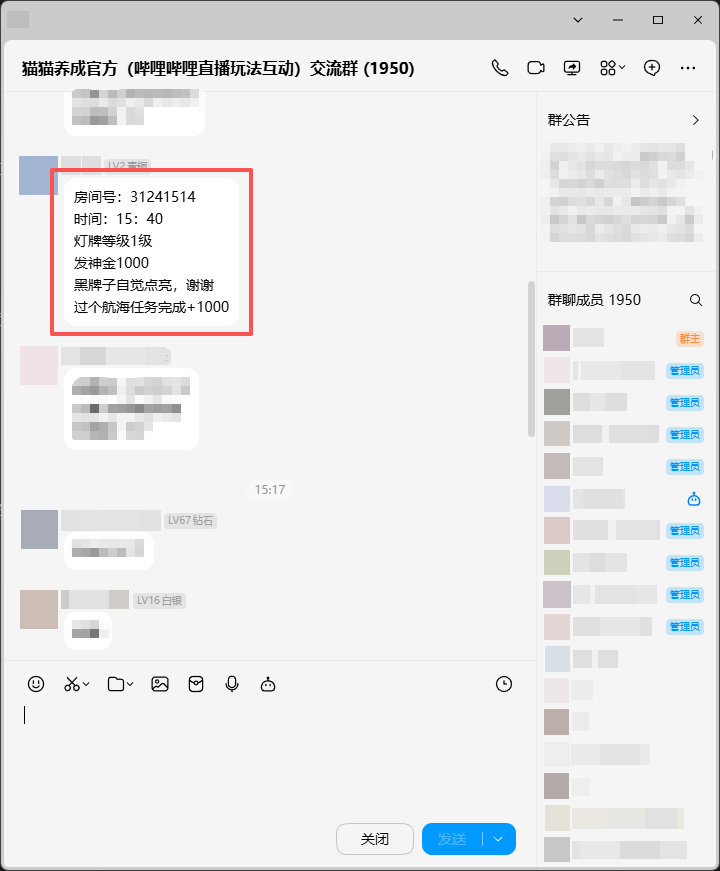

## 前言

猫猫养成是B站里的一个第三方玩法，里面有许多好看的猫猫皮肤、特效，但是购买这些需要很多钻石。

那么如何全自动的获取钻石呢？

## 获取神金消息

神金就是钻石。

猫猫养成开发者创建了几个QQ群，平时有不少人会在里面发神金，例如：



## 提取房间号

可以使用正则来匹配，例如：`\b(\d{6,15})\b`

## 开抢！

发神金时，主播直播间内在场的所有猫猫都可以平分钻石，因此需要在发神金前“下猫”，仅需发个弹幕即可,例如：

``` js
const crypto = require('crypto'), https = require('https'), qs = require('querystring');

// 签名核心
const sign = (p, s) => crypto.createHash('md5').update(Object.keys(p).sort().map(k=>`${k}=${p[k]}`).join('&')+s).digest('hex');

// 核心参数+签名+发送
const params = {
  access_key: '你的key', cid: '直播间ID', msg: '喵',
  appkey: '4409e2ce8ffd12b8', rnd: Date.now()/1000|0, ts: Date.now()/1000|0
};
params.sign = sign(params, '59b43e04ad6965f34319062b478f83dd');

// 发送请求
https.request({
  hostname: 'api.live.bilibili.com',
  path: '/xlive/app-room/v1/dM/sendmsg',
  method: 'POST',
  headers: { 'Content-Type': 'application/x-www-form-urlencoded' }
}, res => { let d=''; res.on('data', chunk=>d+=chunk); res.on('end', ()=>console.log(d)); })
.write(qs.stringify(params)).end();
```

## 结语

以上就是全自动抢神金全流程了，不过听说马上要更新反外挂🤔

更新后我再看看如何破局😋

其实挺想逆向下猫猫养成的主播控制端的（毕竟反外挂的检测代码大概率都是在这里面的），奈何技术不过关呀~