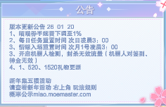

## 前言



猫猫养成作者于昨天(20号)新增了机器人检测，被检测到的账号就算已经下猫了，也无法吃到神金及签到。但经过测试，只要在在线榜上就可以通过检测🤣

## 用魔法对抗魔法

``` js
/** Bilibili 开放平台 App Key */
const BILI_APPKEY = '4409e2ce8ffd12b8'
/** Bilibili 开放平台 App Secret */
const BILI_APPSECRET = '59b43e04ad6965f34319062b478f83dd'

// 1. 移动端进房 (HTTP)
// 必须携带 AppKey 签名，且参数非常多，包含设备指纹(buvid, uuid)
async function mobileEntry(ctx: Context, accessKey: string, roomId: string) {
    // 基础参数
    const params = {
        access_key: accessKey,
        appkey: 'YOUR_APP_KEY',
        room_id: roomId,
        platform: 'android',
        buvid: 'XY789...', // 必须是合法的设备 ID
        uuid: 'AB123...',  // 必须是合法的 UUID
        ts: Math.floor(Date.now() / 1000)
    }
    // 必须签名!
    params['sign'] = sign(params, 'YOUR_APP_SECRET') 

    await ctx.http.post('https://live-trace.bilibili.com/xlive/data-interface/v1/heartbeat/mobileEntry', 
        new URLSearchParams(params) // 必须用 Form Data 格式
    )
}

// 2. 获取移动端 WS 地址 (HTTP)
async function getMobileDanmuInfo(ctx: Context, roomId: string, accessKey: string) {
    const params = {
        access_key: accessKey,
        appkey: 'YOUR_APP_KEY',
        room_id: roomId,
        ts: Math.floor(Date.now() / 1000)
    }
    params['sign'] = sign(params, 'YOUR_APP_SECRET')

    return await ctx.http.get('https://api.live.bilibili.com/xlive/app-room/v1/index/getDanmuInfo', {
        params
    })
}

// 3. 整合流程
async function startMobile(ctx: Context, roomId: string, accessKey: string, uid: number) {
    // [Step 1] 移动端进房
    await mobileEntry(ctx, accessKey, roomId)

    // [Step 2] 获取移动端 WS 信息
    const res = await getMobileDanmuInfo(ctx, roomId, accessKey)
    const { token, host_list } = res.data
    
    // [Step 3] 建立 WS 连接
    const authBody = JSON.stringify({
        uid: uid,
        roomid: parseInt(roomId),
        protover: 2,
        platform: 'android',
        type: 2,
        key: token
    })
    
    new BiliLiveWS(`wss://${host_list[0].host}/sub`, authBody).connect()
}
```
