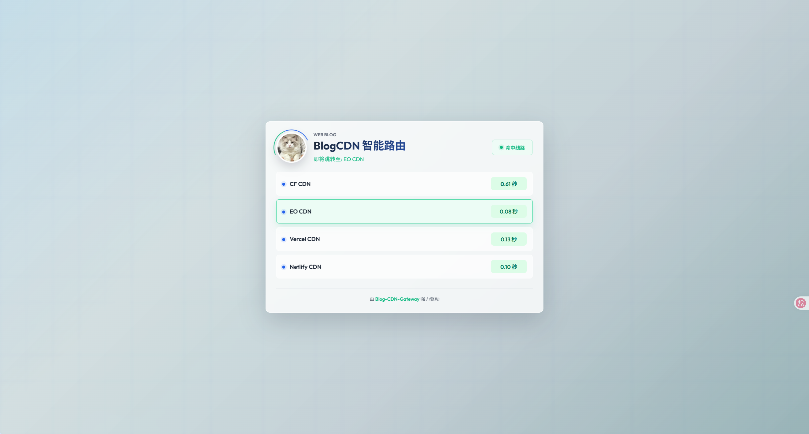

## 一个老问题

做网站的人都绕不开一个问题：CDN 选哪家？

先看看各家的软肋：

**Cloudflare**——最稳，免费额度最慷慨，全球节点最多，但即便套了优选 IP，大陆访问依然不太稳定。

**EdgeOne**——国内访问速度快。但如果你的站不幸被 DDoS 量很大的话，有被清退域名的风险，作为主力线路，这个隐患不能忽视。

**Vercel / Netlify**——部署方便，大陆访问质量也不错，但都有用量限制。

没有哪家 CDN 是完美的。每家都有自己的长处，也都有自己的短板。

那问题来了：既然单 CDN 不靠谱，多挂几家行不行？

听起来是个好主意。但真正动手的时候你会发现，事情没那么简单。

## 多 CDN 的尴尬

传统的多 CDN 方案，无非这几种：

**DNS 智能解析**——根据访客 IP 返回不同 CDN 的地址。听起来智能，实际上粒度很粗。同一个城市的同一个运营商，到不同 CDN 的延迟可能差几倍，DNS 层面根本区分不了。而且 DNS 有缓存，切换不灵活。

**手动切换**——挂了就改解析，切到备用线路。运维同学的噩梦。

**用户自选**——在页面上放几个链接让用户自己选。2026 年了，用户体验倒退二十年。

这些方案要么太粗，要么太慢，要么太反人类。有没有一种方式，能让**用户的浏览器自己判断哪条线路最快**？

## 让浏览器来做决定

既然每家 CDN 都有短板，那正确的做法不是选一家最好的，而是**让最快的那家直接服务用户，同时保留故障转移能力**。

Blog-CDN-Gateway ：谁快用谁。

访客打开网关页面时，浏览器同时向所有 CDN 线路发起 HEAD 请求，哪个先返回 200 就跳哪个。跳转后用户直接访问目标 CDN，不经过网关——没有中间层，没有额外延迟，就是最快的那条线路。同时，如果某条 CDN 挂了，其他线路照常命中，完全不影响访问。

```
访客请求 → 网关页面
              ├─ HEAD → CF CDN      (200, 120ms)
              ├─ HEAD → EO CDN      (200, 85ms)  ✓ 命中
              ├─ HEAD → Vercel CDN  (200, 200ms)
              └─ HEAD → Netlify CDN (超时)
              
              → 自动跳转到 EO CDN
```

这个方案的优雅之处在于：

1. **直接访问最快线路**——命中后用户直接跳到目标 CDN，不经过任何中间层，没有额外延迟
2. **故障自动转移**——某条 CDN 挂了、触发用量限制了，其他线路照样命中，不需要人工干预

## 细节

### 测速怎么做的

```javascript
async function checkRoute(url) {
    const start = Date.now();
    const controller = new AbortController();
    const timeoutId = setTimeout(() => controller.abort(), 3000);

    try {
        await fetch(url, {
            method: 'HEAD',       // 只要头部，不要正文
            mode: 'no-cors',      // 允许跨域，不需要 CDN 配 CORS
            signal: controller.signal,
            cache: 'no-store'     // 不走缓存
        });
        return { latency: Date.now() - start, ok: true };
    } catch {
        return { latency: 9999, ok: false };
    }
}
```

`HEAD` + `no-cors` 是关键组合。HEAD 请求只拿响应头，省流量；`no-cors` 模式下响应虽然无法读取 status，但只要请求没抛错就说明线路可达。3 秒超时，超时即失败。

### SEO 怎么办

网关只做路由，不托管内容。但搜索引擎爬虫需要直接看到博客的 HTML，否则收录会出问题。

解决方案很直接——检测到爬虫 User-Agent 时，网关直接从 CDN 反代内容返回：

```javascript
if (isBot(request.headers.get('user-agent'))) {
    return await proxyToCDN(request, proxyOrigin, path, params);
}
```

爬虫拿到的是真实的博客页面，对 SEO 完全透明。中间层对爬虫来说不存在。

### 配置

全部通过环境变量，一个 `URLS` 变量搞定线路配置：

```javascript
URLS: [
    'https://cf.blog.isyyo.com#CF CDN',
    'https://eo.blog.isyyo.com#EO CDN',
    'https://vercel.blog.isyyo.com#Vercel CDN',
    'https://netlify.blog.isyyo.com#Netlify CDN'
]
```

格式是 `地址#显示名称`，逗号分隔。其他可配置项包括站点名称、背景图、页脚内容、跳转延迟等——都有默认值，不配也能跑。

### 部署

整个网关是一个 JS 文件（`functions/[[path]].js`），支持 Cloudflare Pages/Workers 和 EdgeOne Pages等：

```bash
# Cloudflare
npm run deploy

# EdgeOne
# 用仓库里的 edgeone.json 配置即可
```

## 最后

传统方案要么在服务端做决策（DNS 智能解析），要么让用户做决策（手动选线路）。这个方案把决策权交给了唯一有资格做决定的角色——**用户的浏览器**。

CF 最稳但大陆访问不理想，EO 国内快但有 DDoS 清退风险，Vercel/Netlify 有用量限制——单靠哪一家都不完美。但把它们放在一起，让用户的浏览器实时选出最快的那条，一家挂了自动切到另一家，**直接访问最快线路，不经过任何中间层**。

它不需要全球探测节点，不需要 DNS 配置，不需要任何运维操作。一个文件，几行配置，部署到免费的 Serverless 平台上，就完了。

简单、有效、零运维。

> 项目地址：[yyhhkya/Blog-CDN-Gateway](https://github.com/yyhhkya/Blog-CDN-Gateway)
