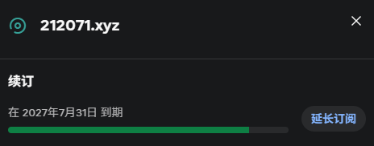
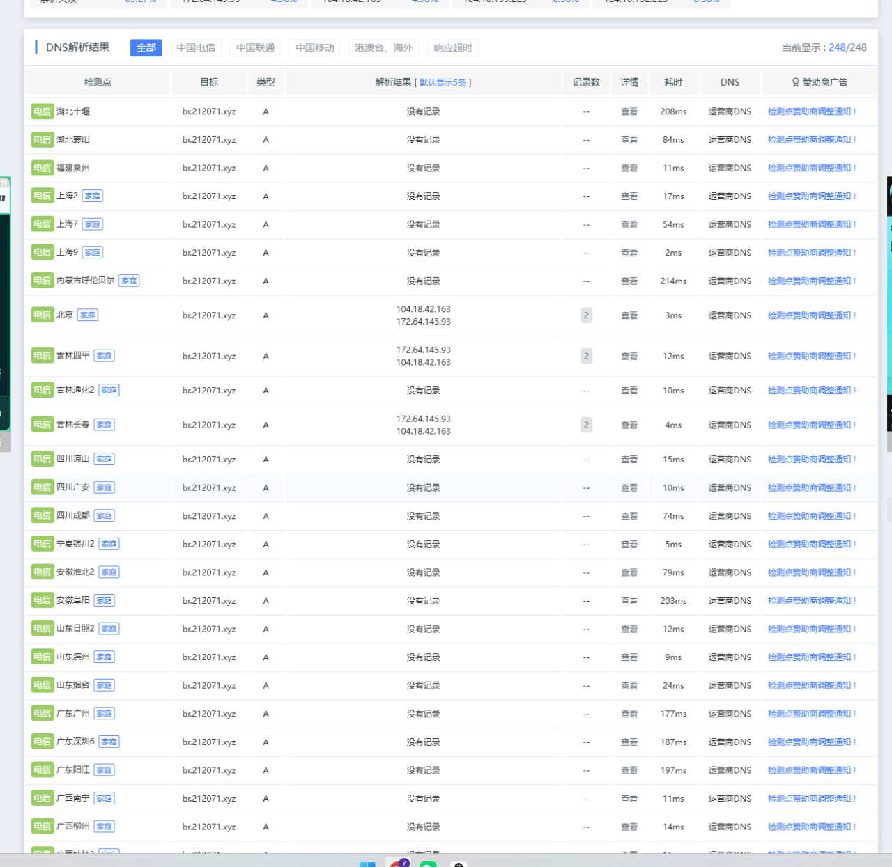
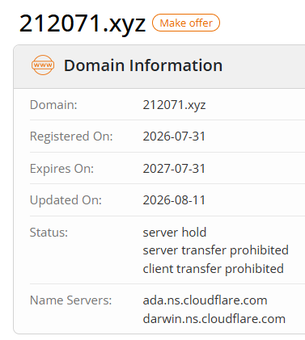
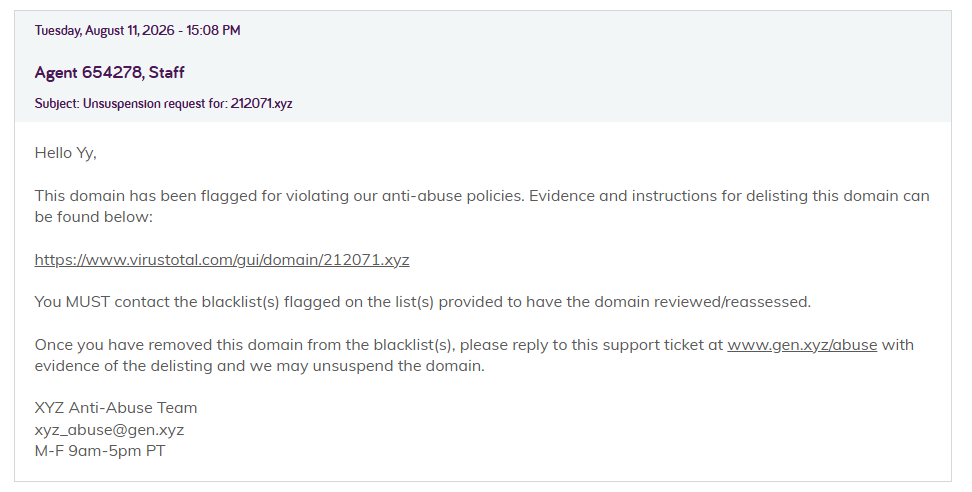
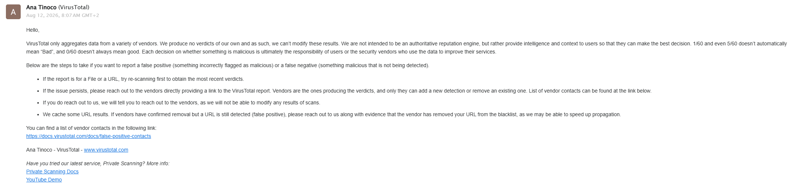
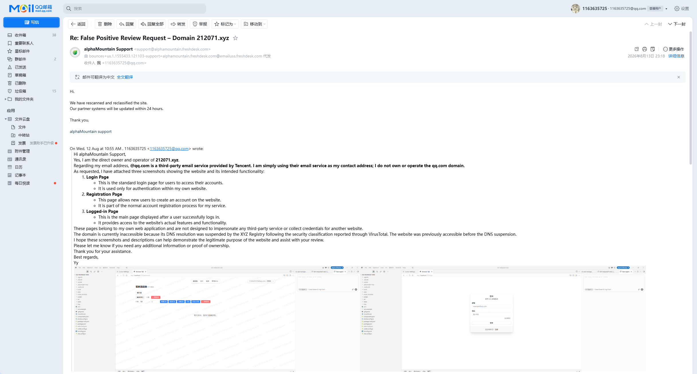
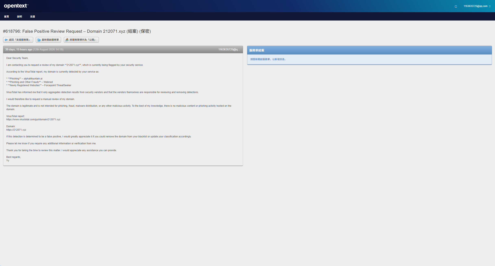

我有一个商业项目需要一个域名，但是我又不想使用我的备案域，所以我就注册了`212071.xyz`。

我那个项目的网站需要注册才可使用，所以我就给这个域名接入了腾讯企业邮用来发验证码。

注册好投入使用2周不到，突然有大量用户找过来说网站无法访问，我当时还以为是cf又抽风了，想着过会就好了，我就先上itdog测了下。

一看，不对劲，怎么是解析不出来？

我也是第一次遇到这种情况，我压根想不到域名是被hold了，况且我这域名也没滥用什么的，还以为是不是我cf上优选没配好，直到我去查了下whois。

当时就震惊了，马上去注册商问了下，注册商让我自行去联系xyz的注册局。

申诉期间各种踢皮球，xyz管局说是系统自动检测让我去联系virustotal。

virustotal又说是第三方的检测让自行去联系。

alphaMountain处理效率挺快的，但是这个Webroot，压根不带理人的！工单发过去，过一两天就给你关闭了，又发又关闭，顿时心里一万只羊驼狂奔。

还好我有先见之明，Webroot的工单第一次被关闭时就去新买了一个域名了（🐶都不用xyz

直到今天，已经是9月21号了，该域名还处于server hold状态...