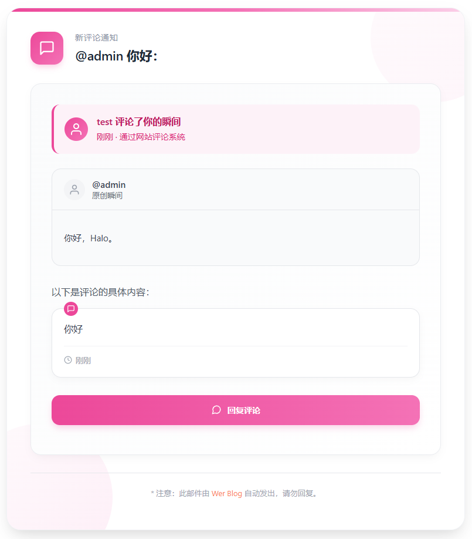

厌倦了Halo默认邮件通知的朴素样式？想让你的订阅者、评论者收到更精美、更专业的邮件通知？

### 📦 前提条件

安装 [邮件模板管理](https://www.halo.run/store/apps/app-rnPqE) 插件，你可以在Halo的应用市场找到它。

### 🎨 效果预览 & 模板

#### 我发布的瞬间收到新评论



<details>
<summary>源码</summary>

```html
<!DOCTYPE html>
<html lang="en">
<head>
    <meta charset="UTF-8">
    <meta name="viewport" content="width=device-width, initial-scale=1.0">
    <title>Document</title>
</head>
<body>
    <div class="notification" style="width: 100%; max-width: 700px; background-color: #ffffff; box-shadow: 0 15px 35px -10px rgba(0, 0, 0, 0.12), 0 10px 20px -8px rgba(0, 0, 0, 0.07); padding: 40px; margin: 0 auto; border-radius: 24px; font-family: 'Segoe UI', Arial, sans-serif; position: relative; overflow: hidden; border: 1px solid #f0f2f5;">
    <!-- 顶部装饰元素 -->

<style>
    .footer {
    display: none !important; /* 强制隐藏 */
    }
</style>

<div style="width: 100%; max-width: 700px; background-color: #ffffff; box-shadow: 0 15px 35px -10px rgba(0, 0, 0, 0.12), 0 10px 20px -8px rgba(0, 0, 0, 0.07); padding: 40px; margin: 0 auto; border-radius: 24px; font-family: 'Segoe UI', Arial, sans-serif; position: relative; overflow: hidden; border: 1px solid #f0f2f5;">
    <!-- 顶部装饰元素 -->
    <div style="position: absolute; top: 0; left: 0; right: 0; height: 6px; background: linear-gradient(90deg, #ec4899, #f472b6, #fbcfe8); z-index: 2;"></div>
    
    <!-- 背景装饰元素 -->
    <div style="position: absolute; top: -60px; right: -60px; width: 220px; height: 220px; border-radius: 50%; background: linear-gradient(135deg, #fdf2f8, #fce7f3); opacity: 0.4; z-index: 0;"></div>
    <div style="position: absolute; bottom: -70px; left: -70px; width: 250px; height: 250px; border-radius: 50%; background: linear-gradient(135deg, #fdf2f8, #fbcfe8); opacity: 0.35; z-index: 0;"></div>
    
    <!-- 通知内容 -->
    <div class="notification-content" style="position: relative; z-index: 1;">
        <!-- 头部区域 -->
        <div class="head" style="display: flex; align-items: center; margin-bottom: 32px;">
            <!-- 评论图标 -->
            <div style="background: linear-gradient(135deg, #ec4899, #f472b6); width: 56px; height: 56px; border-radius: 16px; display: flex; align-items: center; justify-content: center; margin-right: 20px; box-shadow: 0 6px 12px -3px rgba(236, 72, 153, 0.3);">
                <svg xmlns="http://www.w3.org/2000/svg" width="28" height="28" viewBox="0 0 24 24" fill="none" stroke="white" stroke-width="2" stroke-linecap="round" stroke-linejoin="round">
                    <path d="M21 15a2 2 0 0 1-2 2H7l-4 4V5a2 2 0 0 1 2-2h14a2 2 0 0 1 2 2z"></path>
                </svg>
            </div>
            
            <div>
                <p style="color: #8b92a5; font-size: 14px; margin: 0 0 6px 0; letter-spacing: 0.7px; text-transform: uppercase; font-weight: 500;">新评论通知</p>
                <p class="honorific" th:text="|${subscriber.displayName} 你好：|" style="font-size: 22px; font-weight: 600; color: #1f2937; margin: 0; letter-spacing: -0.3px;"></p>
            </div>
        </div>
        
        <!-- 主体内容 -->
        <div class="body" style="background: linear-gradient(to bottom right, #fafbfc, #ffffff); padding: 35px; border-radius: 18px; border: 1px solid #eaecf0; box-shadow: 0 6px 16px -4px rgba(0, 0, 0, 0.05); margin-bottom: 30px;">
            <!-- 评论者信息 -->
            <div style="background-color: #fdf2f8; border-radius: 14px; padding: 18px; margin-bottom: 25px; display: flex; align-items: center; border-left: 4px solid #ec4899;">
                <div style="width: 40px; height: 40px; border-radius: 50%; background: linear-gradient(135deg, #ec4899, #f472b6); display: flex; align-items: center; justify-content: center; margin-right: 15px; flex-shrink: 0; overflow: hidden;">
                    <!-- 用户头像占位符，可替换为实际头像 -->
                    <svg xmlns="http://www.w3.org/2000/svg" width="24" height="24" viewBox="0 0 24 24" fill="none" stroke="white" stroke-width="2" stroke-linecap="round" stroke-linejoin="round">
                        <path d="M20 21v-2a4 4 0 0 0-4-4H8a4 4 0 0 0-4 4v2"></path>
                        <circle cx="12" cy="7" r="4"></circle>
                    </svg>
                </div>
                <div>
                    <p style="margin: 0 0 5px 0; font-weight: 600; color: #be185d; font-size: 16px;" th:text="|${commenter} 评论了你的瞬间|">Sarah 评论了你的瞬间</p>
                    <p style="margin: 0; color: #db2777; font-size: 14px; line-height: 1.6;">
                        刚刚 · 通过网站评论系统
                    </p>
                </div>
            </div>
            
            <!-- 原瞬间内容卡片 -->
            <div style="background-color: #f9fafb; border: 1px solid #e5e7eb; border-radius: 16px; padding: 0; margin-bottom: 30px; overflow: hidden;">
                <!-- 瞬间头部 -->
                <div style="padding: 16px 20px; display: flex; align-items: center; border-bottom: 1px solid #e5e7eb;">
                    <div style="width: 36px; height: 36px; border-radius: 50%; background-color: #f3f4f6; display: flex; align-items: center; justify-content: center; margin-right: 12px; overflow: hidden;">
                        <!-- 用户自己的头像占位符 -->
                        <svg xmlns="http://www.w3.org/2000/svg" width="20" height="20" viewBox="0 0 24 24" fill="none" stroke="#9ca3af" stroke-width="2" stroke-linecap="round" stroke-linejoin="round">
                            <path d="M20 21v-2a4 4 0 0 0-4-4H8a4 4 0 0 0-4 4v2"></path>
                            <circle cx="12" cy="7" r="4"></circle>
                        </svg>
                    </div>
                    <div>
                        <p style="margin: 0; font-weight: 600; color: #374151; font-size: 15px;" th:text="${subscriber.displayName}">你的名字</p>
                        <p style="margin: 0; color: #6b7280; font-size: 13px;">原创瞬间</p>
                    </div>
                </div>
                
                <!-- 瞬间内容 -->
                <div style="padding: 20px;">
                    <a th:href="${momentUrl}" target="_blank" style="display: block; text-decoration: none; color: #374151; font-size: 15px; line-height: 1.6; margin-bottom: 15px;" th:utext="${momentHtmlContent}">
                        这是一段瞬间内容的示例，展示了用户分享的想法或图片。
                    </a>
                </div>
            </div>
            
            <!-- 评论内容卡片 -->
            <div style="margin-bottom: 25px;">
                <p style="color: #4b5563; margin-bottom: 15px; line-height: 1.7; font-size: 16px; font-weight: 500;">
                    以下是评论的具体内容：
                </p>
                
                <div style="background-color: #ffffff; border: 1px solid #e5e7eb; border-radius: 16px; padding: 20px; margin-bottom: 20px; position: relative; box-shadow: 0 4px 12px rgba(0, 0, 0, 0.03);">
                    <!-- 引用标记 -->
                    <div style="position: absolute; top: -12px; left: 20px; width: 24px; height: 24px; background-color: #ec4899; border-radius: 50%; display: flex; align-items: center; justify-content: center;">
                        <svg xmlns="http://www.w3.org/2000/svg" width="14" height="14" viewBox="0 0 24 24" fill="none" stroke="white" stroke-width="2" stroke-linecap="round" stroke-linejoin="round">
                            <path d="M21 15a2 2 0 0 1-2 2H7l-4 4V5a2 2 0 0 1 2-2h14a2 2 0 0 1 2 2z"></path>
                        </svg>
                    </div>
                    
                    <pre class="content" th:text="${content}" style="font-family: 'Segoe UI', Arial, sans-serif; white-space: pre-wrap; word-wrap: break-word; margin: 0; color: #374151; line-height: 1.7; font-size: 16px;">这是评论内容示例，表达了用户对瞬间的看法和感受。</pre>
                    
                    <!-- 评论时间和来源 -->
                    <div style="display: flex; align-items: center; margin-top: 15px; padding-top: 15px; border-top: 1px solid #f3f4f6;">
                        <svg xmlns="http://www.w3.org/2000/svg" width="14" height="14" viewBox="0 0 24 24" fill="none" stroke="#9ca3af" stroke-width="2" stroke-linecap="round" stroke-linejoin="round" style="margin-right: 6px;">
                            <circle cx="12" cy="12" r="10"></circle>
                            <polyline points="12 6 12 12 16 14"></polyline>
                        </svg>
                        <span style="color: #9ca3af; font-size: 13px;">刚刚</span>
                    </div>
                </div>
            </div>
            
            <!-- 操作按钮 -->
            <div style="display: flex; flex-wrap: wrap; gap: 15px; margin: 30px 0 15px 0;">
                <a th:href="${site.url} + '/moments'" target="_blank" style="flex: 1; min-width: 160px; display: inline-flex; align-items: center; justify-content: center; background: linear-gradient(to right, #ec4899, #f472b6); color: white; padding: 16px 20px; border-radius: 14px; font-weight: 600; text-decoration: none; transition: all 0.3s ease; box-shadow: 0 6px 12px -2px rgba(236, 72, 153, 0.25);" onmouseover="this.style.transform='translateY(-3px)';this.style.boxShadow='0 8px 16px -2px rgba(236, 72, 153, 0.35)';" onmouseout="this.style.transform='translateY(0)';this.style.boxShadow='0 6px 12px -2px rgba(236, 72, 153, 0.25)';">
                    <svg xmlns="http://www.w3.org/2000/svg" width="18" height="18" viewBox="0 0 24 24" fill="none" stroke="currentColor" stroke-width="2" stroke-linecap="round" stroke-linejoin="round" style="margin-right: 10px;">
                        <path d="M21 11.5a8.38 8.38 0 0 1-.9 3.8 8.5 8.5 0 0 1-7.6 4.7 8.38 8.38 0 0 1-3.8-.9L3 21l1.9-5.7a8.38 8.38 0 0 1-.9-3.8 8.5 8.5 0 0 1 4.7-7.6 8.38 8.38 0 0 1 3.8-.9h.5a8.48 8.48 0 0 1 8 8v.5z"></path>
                    </svg>
                    回复评论
                </a>
            </div>
        </div>
        
        <!-- 底部区域 -->
        <div style="text-align: center; margin-top: 30px; padding-top: 20px; border-top: 1px solid #e5e7eb;">
            <p style="color: #9ca3af; font-size: 13px; margin: 5px 0;">
                * 注意：此邮件由 <a th:href="${site.url}" th:text="${site.title}" target="_blank" style="color:#fa7e5b;text-decoration:none;"></a> 自动发出，请勿回复。</p>
            </p>
        </div>
    </div>
</div>
```

</details>

#### 有人回复了我


<details>
<summary>源码</summary>

```html
    <style>
      .footer {
        display: none !important; /* 强制隐藏 */
      }
    </style>
    
    <div style="width: 100%; max-width: 700px; background-color: #ffffff; box-shadow: 0 12px 25px -5px rgba(0, 0, 0, 0.1), 0 8px 15px -6px rgba(0, 0, 0, 0.05); padding: 35px; margin: 0 auto; border-radius: 16px; font-family: 'Segoe UI', Arial, sans-serif; position: relative; overflow: hidden;">
        <!-- 装饰性背景元素 -->
        <div style="position: absolute; top: -30px; right: -30px; width: 160px; height: 160px; border-radius: 50%; background: linear-gradient(135deg, #f0f9ff, #e0f2fe); opacity: 0.6; z-index: 0;"></div>
        <div style="position: absolute; bottom: -40px; left: -40px; width: 180px; height: 180px; border-radius: 50%; background: linear-gradient(135deg, #f0f7ff, #e0f7fa); opacity: 0.5; z-index: 0;"></div>
        
        <!-- 通知内容 -->
        <div class="notification-content" style="position: relative; z-index: 1;">
            <!-- 顶部装饰条 -->
            <div style="height: 5px; width: 100%; background: linear-gradient(90deg, #0ea5e9, #38bdf8, #7dd3fc); border-radius: 10px; margin-bottom: 25px;"></div>
            
            <!-- 头部问候 -->
            <div class="head" style="margin-bottom: 25px; display: flex; align-items: center;">
                <!-- 通知图标 -->
                <div style="background-color: #e0f2fe; width: 48px; height: 48px; border-radius: 12px; display: flex; align-items: center; justify-content: center; margin-right: 15px; box-shadow: 0 4px 6px -1px rgba(14, 165, 233, 0.2);">
                    <svg xmlns="http://www.w3.org/2000/svg" width="24" height="24" viewBox="0 0 24 24" fill="none" stroke="#0284c7" stroke-width="2" stroke-linecap="round" stroke-linejoin="round">
                        <path d="M21 15a2 2 0 0 1-2 2H7l-4 4V5a2 2 0 0 1 2-2h14a2 2 0 0 1 2 2z"></path>
                    </svg>
                </div>
                <p class="honorific" th:text="|${subscriber.displayName} 你好：|" style="font-size: 20px; font-weight: 600; color: #0f172a; margin: 0;"></p>
            </div>
            
            <!-- 通知主体 -->
            <div class="body" style="background: linear-gradient(to right, #f8fafc, #f1f5f9); padding: 25px; border-radius: 14px; border-left: 4px solid #0ea5e9; margin-bottom: 25px; box-shadow: 0 4px 6px -1px rgba(0, 0, 0, 0.05);">
                <p style="color: #334155; font-size: 16px; line-height: 1.7; margin-top: 0; margin-bottom: 15px;">
                    <span style="font-weight: 600; color: #0284c7;" th:text="${replier}"></span> 在评论 
                    <a th:href="${commentSubjectUrl}" target="_blank" th:text="|”${isQuoteReply ? quoteContent : commentContent}”|" ></a>
                    <span>中回复了你，以下是回复的具体内容：</span>
                </p>
                
                <!-- 回复内容 -->
                <div style="position: relative; margin-top: 20px;">
                    <!-- 装饰性引号 -->
                    <svg xmlns="http://www.w3.org/2000/svg" width="30" height="30" viewBox="0 0 24 24" fill="#cbd5e1" style="position: absolute; top: -15px; left: -10px; opacity: 0.5;">
                        <path d="M14.017 21v-7.391c0-5.704 3.731-9.57 8.983-10.609l.995 2.151c-2.432.917-3.995 3.638-3.995 5.849h4v10h-9.983zm-14.017 0v-7.391c0-5.704 3.748-9.57 9-10.609l.996 2.151c-2.433.917-3.996 3.638-3.996 5.849h3.983v10h-9.983z"/>
                    </svg>
                    
                    <pre class="content" th:text="${content}" style="background-color: #ffffff; padding: 20px; border-radius: 10px; font-family: inherit; white-space: pre-wrap; word-wrap: break-word; color: #475569; font-size: 15px; line-height: 1.6; margin: 0; border: 1px solid #e2e8f0; box-shadow: 0 2px 4px rgba(0, 0, 0, 0.05);"></pre>
                </div>
            </div>
            
            <!-- 鼓励回复区域 -->
            <div style="background-color: #f0f9ff; padding: 20px; border-radius: 12px; margin-top: 25px; border: 1px dashed #bae6fd; transition: all 0.3s ease;" onmouseover="this.style.backgroundColor='#e0f2fe';this.style.transform='translateY(-3px)';this.style.boxShadow='0 6px 12px -3px rgba(14, 165, 233, 0.15)';" onmouseout="this.style.backgroundColor='#f0f9ff';this.style.transform='translateY(0)';this.style.boxShadow='none';">
                <div style="display: flex; align-items: center; margin-bottom: 15px;">
                    <div style="background-color: #bae6fd; width: 36px; height: 36px; border-radius: 50%; display: flex; align-items: center; justify-content: center; margin-right: 12px;">
                        <span style="font-size: 18px;">💬</span>
                    </div>
                    <h3 style="margin: 0; color: #0c4a6e; font-size: 17px; font-weight: 600;">期待你的回复</h3>
                </div>
                <p style="color: #0369a1; font-size: 15px; line-height: 1.6; margin: 0 0 15px 0;">
                    精彩的对话正在继续！点击下方按钮立即查看并回复这条评论，分享你的想法。
                </p>
                <div style="text-align: center;">
                    <a th:href="${commentSubjectUrl}" target="_blank" style="display: inline-flex; align-items: center; background: linear-gradient(to right, #0284c7, #0ea5e9); color: white; padding: 12px 24px; border-radius: 9999px; font-weight: 600; text-decoration: none; font-size: 15px; transition: all 0.3s ease; box-shadow: 0 4px 6px -1px rgba(14, 165, 233, 0.3);" onmouseover="this.style.transform='translateY(-2px)';this.style.boxShadow='0 6px 10px -2px rgba(14, 165, 233, 0.4)';" onmouseout="this.style.transform='translateY(0)';this.style.boxShadow='0 4px 6px -1px rgba(14, 165, 233, 0.3)';">
                        立即回复
                        <svg xmlns="http://www.w3.org/2000/svg" width="18" height="18" viewBox="0 0 24 24" fill="none" stroke="currentColor" stroke-width="2" stroke-linecap="round" stroke-linejoin="round" style="margin-left: 8px;">
                            <path d="M15 15l6-6m0 0l-6-6m6 6H3"></path>
                        </svg>
                    </a>
                </div>
            </div>
            
            <!-- 互动提示 -->
            <div style="display: flex; align-items: center; margin-top: 30px; padding-top: 20px; border-top: 1px solid #e2e8f0;">
                <div style="display: flex; margin-right: 15px;">
                    <div style="width: 30px; height: 30px; background-color: #dbeafe; border-radius: 50%; display: flex; align-items: center; justify-content: center; position: relative; z-index: 3; box-shadow: 0 2px 4px rgba(59, 130, 246, 0.2);">
                        <span style="font-size: 14px;">🚀</span>
                    </div>
                    <div style="width: 30px; height: 30px; background-color: #c7d2fe; border-radius: 50%; display: flex; align-items: center; justify-content: center; position: relative; z-index: 2; margin-left: -10px; box-shadow: 0 2px 4px rgba(79, 70, 229, 0.2);">
                        <span style="font-size: 14px;">💡</span>
                    </div>
                    <div style="width: 30px; height: 30px; background-color: #bfdbfe; border-radius: 50%; display: flex; align-items: center; justify-content: center; position: relative; z-index: 1; margin-left: -10px; box-shadow: 0 2px 4px rgba(59, 130, 246, 0.2);">
                        <span style="font-size: 14px;">✨</span>
                    </div>
                </div>
                <p style="color: #64748b; font-size: 14px; margin: 0;">
                    积极参与讨论，让思想的火花继续闪耀！
                </p>
            </div>
            
            <!-- 底部信息 -->
            <div style="text-align: center; margin-top: 30px; font-size: 13px; color: #94a3b8;">
                * 注意：此邮件由 <a th:href="${site.url}" th:text="${site.title}" target="_blank" style="color:#fa7e5b;text-decoration:none;"></a> 自动发出，请勿回复。</p>
            </div>
        </div>
    </div>
```

</details>

#### 我的自定义页面收到新评论


<details>
<summary>源码</summary>

```html
    <style>
      .footer {
        display: none !important; /* 强制隐藏 */
      }
    </style>
    
    <div style="width: 100%; max-width: 700px; background-color: #ffffff; box-shadow: 0 15px 35px -10px rgba(0, 0, 0, 0.12), 0 10px 20px -8px rgba(0, 0, 0, 0.07); padding: 40px; margin: 0 auto; border-radius: 24px; font-family: 'Segoe UI', Arial, sans-serif; position: relative; overflow: hidden; border: 1px solid #f0f2f5;">
        <!-- 顶部装饰元素 -->
        <div style="position: absolute; top: 0; left: 0; right: 0; height: 6px; background: linear-gradient(90deg, #047857, #10b981, #34d399); z-index: 2;"></div>
        
        <!-- 背景装饰元素 -->
        <div style="position: absolute; top: -60px; right: -60px; width: 220px; height: 220px; border-radius: 50%; background: linear-gradient(135deg, #ecfdf5, #d1fae5); opacity: 0.4; z-index: 0;"></div>
        <div style="position: absolute; bottom: -70px; left: -70px; width: 250px; height: 250px; border-radius: 50%; background: linear-gradient(135deg, #ecfdf5, #a7f3d0); opacity: 0.35; z-index: 0;"></div>
        
        <!-- 通知内容 -->
        <div class="notification-content" style="position: relative; z-index: 1;">
            <!-- 头部区域 -->
            <div class="head" style="display: flex; align-items: center; margin-bottom: 32px;">
                <!-- 评论图标 -->
                <div style="background: linear-gradient(135deg, #047857, #10b981); width: 56px; height: 56px; border-radius: 16px; display: flex; align-items: center; justify-content: center; margin-right: 20px; box-shadow: 0 6px 12px -3px rgba(16, 185, 129, 0.3);">
                    <svg xmlns="http://www.w3.org/2000/svg" width="28" height="28" viewBox="0 0 24 24" fill="none" stroke="white" stroke-width="2" stroke-linecap="round" stroke-linejoin="round">
                        <path d="M21 15a2 2 0 0 1-2 2H7l-4 4V5a2 2 0 0 1 2-2h14a2 2 0 0 1 2 2z"></path>
                    </svg>
                </div>
                
                <div>
                    <p style="color: #8b92a5; font-size: 14px; margin: 0 0 6px 0; letter-spacing: 0.7px; text-transform: uppercase; font-weight: 500;">新评论通知</p>
                    <p class="honorific" th:text="|${subscriber.displayName} 你好：|" style="font-size: 22px; font-weight: 600; color: #1f2937; margin: 0; letter-spacing: -0.3px;"></p>
                </div>
            </div>
            
            <!-- 主体内容 -->
            <div class="body" style="background: linear-gradient(to bottom right, #fafbfc, #ffffff); padding: 35px; border-radius: 18px; border: 1px solid #eaecf0; box-shadow: 0 6px 16px -4px rgba(0, 0, 0, 0.05); margin-bottom: 30px;">
                <!-- 评论者信息 -->
                <div style="background-color: #ecfdf5; border-radius: 14px; padding: 18px; margin-bottom: 25px; display: flex; align-items: center; border-left: 4px solid #10b981;">
                    <div style="width: 40px; height: 40px; border-radius: 50%; background: linear-gradient(135deg, #047857, #10b981); display: flex; align-items: center; justify-content: center; margin-right: 15px; flex-shrink: 0; overflow: hidden;">
                        <!-- 用户头像占位符，可替换为实际头像 -->
                        <svg xmlns="http://www.w3.org/2000/svg" width="24" height="24" viewBox="0 0 24 24" fill="none" stroke="white" stroke-width="2" stroke-linecap="round" stroke-linejoin="round">
                            <path d="M20 21v-2a4 4 0 0 0-4-4H8a4 4 0 0 0-4 4v2"></path>
                            <circle cx="12" cy="7" r="4"></circle>
                        </svg>
                    </div>
                    <div>
                        <p style="margin: 0 0 5px 0; font-weight: 600; color: #065f46; font-size: 16px;">
                            <span th:text="${commenter}">John Doe</span> 评论了你的页面
                        </p>
                        <p style="margin: 0; color: #047857; font-size: 14px; line-height: 1.6;">
                            刚刚 · 通过网站评论系统
                        </p>
                    </div>
                </div>
                
                <!-- 页面信息卡片 -->
                <div style="background-color: #f8fafc; border: 1px solid #e2e8f0; border-radius: 16px; padding: 20px; margin-bottom: 25px;">
                    <div style="display: flex; align-items: center; margin-bottom: 15px;">
                        <div style="width: 36px; height: 36px; border-radius: 8px; background-color: #f1f5f9; display: flex; align-items: center; justify-content: center; margin-right: 12px;">
                            <svg xmlns="http://www.w3.org/2000/svg" width="20" height="20" viewBox="0 0 24 24" fill="none" stroke="#64748b" stroke-width="2" stroke-linecap="round" stroke-linejoin="round">
                                <path d="M14 2H6a2 2 0 0 0-2 2v16a2 2 0 0 0 2 2h12a2 2 0 0 0 2-2V8z"></path>
                                <polyline points="14 2 14 8 20 8"></polyline>
                                <line x1="16" y1="13" x2="8" y2="13"></line>
                                <line x1="16" y1="17" x2="8" y2="17"></line>
                                <polyline points="10 9 9 9 8 9"></polyline>
                            </svg>
                        </div>
                        <div>
                            <p style="margin: 0; color: #64748b; font-size: 13px;">评论页面</p>
                            <a th:href="${pageUrl}" target="_blank" th:text="|《${pageTitle}》|" style="margin: 0; color: #0f172a; font-size: 16px; font-weight: 600; text-decoration: none; transition: color 0.2s ease;" onmouseover="this.style.color='#10b981'" onmouseout="this.style.color='#0f172a'">《如何提高工作效率》</a>
                        </div>
                    </div>
                </div>
                
                <!-- 评论内容卡片 -->
                <div style="margin-bottom: 25px;">
                    <p style="color: #4b5563; margin-bottom: 15px; line-height: 1.7; font-size: 16px; font-weight: 500;">
                        以下是评论的具体内容：
                    </p>
                    
                    <div style="background-color: #ffffff; border: 1px solid #e2e8f0; border-radius: 16px; padding: 20px; margin-bottom: 20px; position: relative; box-shadow: 0 4px 12px rgba(0, 0, 0, 0.03);">
                        <!-- 引用标记 -->
                        <div style="position: absolute; top: -12px; left: 20px; width: 24px; height: 24px; background-color: #10b981; border-radius: 50%; display: flex; align-items: center; justify-content: center;">
                            <svg xmlns="http://www.w3.org/2000/svg" width="14" height="14" viewBox="0 0 24 24" fill="none" stroke="white" stroke-width="2" stroke-linecap="round" stroke-linejoin="round">
                                <path d="M21 15a2 2 0 0 1-2 2H7l-4 4V5a2 2 0 0 1 2-2h14a2 2 0 0 1 2 2z"></path>
                            </svg>
                        </div>
                        
                        <pre class="content" th:text="${content}" style="font-family: 'Segoe UI', Arial, sans-serif; white-space: pre-wrap; word-wrap: break-word; margin: 0; color: #374151; line-height: 1.7; font-size: 16px;">这是一条评论内容示例，用户可能对你的文章表达了感谢、提出了问题或分享了自己的观点。评论可能会很长，也可能很短，这里展示了评论的完整内容。</pre>
                        
                        <!-- 评论时间和来源 -->
                        <div style="display: flex; align-items: center; margin-top: 15px; padding-top: 15px; border-top: 1px solid #f1f5f9;">
                            <svg xmlns="http://www.w3.org/2000/svg" width="14" height="14" viewBox="0 0 24 24" fill="none" stroke="#94a3b8" stroke-width="2" stroke-linecap="round" stroke-linejoin="round" style="margin-right: 6px;">
                                <circle cx="12" cy="12" r="10"></circle>
                                <polyline points="12 6 12 12 16 14"></polyline>
                            </svg>
                            <span style="color: #94a3b8; font-size: 13px;">刚刚</span>
                        </div>
                    </div>
                </div>
                
                <!-- 操作按钮 -->
                <div style="display: flex; flex-wrap: wrap; gap: 15px; margin: 30px 0 15px 0;">
                    <a th:href="${pageUrl}" target="_blank" style="flex: 1; min-width: 160px; display: inline-flex; align-items: center; justify-content: center; background: linear-gradient(to right, #047857, #10b981); color: white; padding: 16px 20px; border-radius: 14px; font-weight: 600; text-decoration: none; transition: all 0.3s ease; box-shadow: 0 6px 12px -2px rgba(16, 185, 129, 0.25);" onmouseover="this.style.transform='translateY(-3px)';this.style.boxShadow='0 8px 16px -2px rgba(16, 185, 129, 0.35)';" onmouseout="this.style.transform='translateY(0)';this.style.boxShadow='0 6px 12px -2px rgba(16, 185, 129, 0.25)';">
                        <svg xmlns="http://www.w3.org/2000/svg" width="18" height="18" viewBox="0 0 24 24" fill="none" stroke="currentColor" stroke-width="2" stroke-linecap="round" stroke-linejoin="round" style="margin-right: 10px;">
                            <path d="M21 11.5a8.38 8.38 0 0 1-.9 3.8 8.5 8.5 0 0 1-7.6 4.7 8.38 8.38 0 0 1-3.8-.9L3 21l1.9-5.7a8.38 8.38 0 0 1-.9-3.8 8.5 8.5 0 0 1 4.7-7.6 8.38 8.38 0 0 1 3.8-.9h.5a8.48 8.48 0 0 1 8 8v.5z"></path>
                        </svg>
                        回复评论
                    </a>
                </div>
            </div>
            
            <!-- 底部区域 -->
            <div style="text-align: center; margin-top: 30px; padding-top: 20px; border-top: 1px solid #e2e8f0;">
                <p style="color: #94a3b8; font-size: 13px; margin: 5px 0;">
                    * 注意：此邮件由 <a th:href="${site.url}" th:text="${site.title}" target="_blank" style="color:#fa7e5b;text-decoration:none;"></a> 自动发出，请勿回复。</p>
                </p>
            </div>
        </div>
    </div>
```

</details>

#### 我的文章收到新评论


<details>
<summary>源码</summary>

```html
    <style>
      .footer {
        display: none !important; /* 强制隐藏 */
      }
    </style>
    
    <div style="width: 100%; max-width: 700px; background-color: #ffffff; box-shadow: 0 15px 35px rgba(0, 0, 0, 0.08); padding: 0; margin: 0 auto; border-radius: 20px; font-family: 'SF Pro Display', -apple-system, BlinkMacSystemFont, 'Segoe UI', Roboto, sans-serif; overflow: hidden; border: 1px solid #f0f2f5;">
        <!-- 顶部横幅 -->
        <div style="background: linear-gradient(120deg, #4338ca, #6366f1, #818cf8); padding: 35px 40px; position: relative; overflow: hidden;">
            <!-- 装饰元素 -->
            <div style="position: absolute; top: -20px; right: -20px; width: 140px; height: 140px; border-radius: 50%; background: rgba(255, 255, 255, 0.1);"></div>
            <div style="position: absolute; bottom: -40px; left: -20px; width: 180px; height: 180px; border-radius: 50%; background: rgba(255, 255, 255, 0.08);"></div>
            
            <div style="position: relative; z-index: 2; display: flex; align-items: center;">
                <div style="width: 56px; height: 56px; border-radius: 16px; background: rgba(255, 255, 255, 0.2); backdrop-filter: blur(10px); -webkit-backdrop-filter: blur(10px); display: flex; align-items: center; justify-content: center; margin-right: 20px; box-shadow: 0 8px 16px rgba(0, 0, 0, 0.1);">
                    <svg xmlns="http://www.w3.org/2000/svg" width="28" height="28" viewBox="0 0 24 24" fill="none" stroke="white" stroke-width="2" stroke-linecap="round" stroke-linejoin="round">
                        <path d="M21 15a2 2 0 0 1-2 2H7l-4 4V5a2 2 0 0 1 2-2h14a2 2 0 0 1 2 2z"></path>
                    </svg>
                </div>
                <div>
                    <p style="color: rgba(255, 255, 255, 0.9); font-size: 15px; margin: 0 0 6px 0; letter-spacing: 0.5px; font-weight: 500;">新评论通知</p>
                    <p class="honorific" th:text="|${subscriber.displayName} 你好：|" style="font-size: 24px; font-weight: 700; color: white; margin: 0; letter-spacing: -0.3px;"></p>
                </div>
            </div>
        </div>
        
        <!-- 主体内容 -->
        <div style="padding: 40px;">
            <!-- 通知简介 -->
            <p style="color: #4b5563; line-height: 1.7; font-size: 17px; margin: 0 0 30px 0; font-weight: 400;">
                您的文章收到了新的评论，以下是详细信息：
            </p>
            
            <!-- 文章信息卡片 -->
            <div style="background-color: #f9fafb; border: 1px solid #e5e7eb; border-radius: 16px; padding: 20px; margin-bottom: 30px; transition: transform 0.2s ease, box-shadow 0.2s ease; position: relative; overflow: hidden;">
                <!-- 背景装饰 -->
                <div style="position: absolute; top: -30px; right: -30px; width: 100px; height: 100px; border-radius: 50%; background: linear-gradient(135deg, #e0e7ff, #c7d2fe); opacity: 0.3;"></div>
                
                <div style="position: relative; display: flex; align-items: center;">
                    <div style="width: 48px; height: 48px; border-radius: 12px; background: linear-gradient(135deg, #4338ca, #6366f1); display: flex; align-items: center; justify-content: center; margin-right: 16px; flex-shrink: 0; box-shadow: 0 4px 10px rgba(99, 102, 241, 0.2);">
                        <svg xmlns="http://www.w3.org/2000/svg" width="24" height="24" viewBox="0 0 24 24" fill="none" stroke="white" stroke-width="2" stroke-linecap="round" stroke-linejoin="round">
                            <path d="M19 21l-7-5-7 5V5a2 2 0 0 1 2-2h10a2 2 0 0 1 2 2z"></path>
                        </svg>
                    </div>
                    <div style="overflow: hidden; flex: 1;">
                        <p style="margin: 0 0 5px 0; font-size: 14px; color: #6b7280; font-weight: 500;">您的文章</p>
                        <a th:href="${postUrl}" target="_blank" th:text="|《${postTitle}》|" style="color: #4338ca; text-decoration: none; font-weight: 600; font-size: 17px; white-space: nowrap; overflow: hidden; text-overflow: ellipsis; display: block; margin: 0;"></a>
                    </div>
                    <div style="margin-left: 15px; flex-shrink: 0;">
                        <div style="display: flex; align-items: center; background-color: #eef2ff; padding: 6px 12px; border-radius: 20px;">
                            <svg xmlns="http://www.w3.org/2000/svg" width="14" height="14" viewBox="0 0 24 24" fill="none" stroke="#4338ca" stroke-width="2" stroke-linecap="round" stroke-linejoin="round" style="margin-right: 5px;">
                                <path d="M21 15a2 2 0 0 1-2 2H7l-4 4V5a2 2 0 0 1 2-2h14a2 2 0 0 1 2 2z"></path>
                            </svg>
                            <span style="color: #4338ca; font-size: 13px; font-weight: 600;">新评论</span>
                        </div>
                    </div>
                </div>
            </div>
            
            <!-- 评论内容区域 -->
            <div style="margin-bottom: 35px;">
                <!-- 评论者信息 -->
                <div style="display: flex; align-items: center; margin-bottom: 16px;">
                    <div style="width: 44px; height: 44px; border-radius: 50%; background-color: #f3f4f6; overflow: hidden; margin-right: 14px; display: flex; align-items: center; justify-content: center; border: 2px solid #e5e7eb;">
                        <svg xmlns="http://www.w3.org/2000/svg" width="22" height="22" viewBox="0 0 24 24" fill="none" stroke="#6b7280" stroke-width="2" stroke-linecap="round" stroke-linejoin="round">
                            <path d="M20 21v-2a4 4 0 0 0-4-4H8a4 4 0 0 0-4 4v2"></path>
                            <circle cx="12" cy="7" r="4"></circle>
                        </svg>
                    </div>
                    <div>
                        <p style="margin: 0 0 2px 0; font-weight: 600; color: #1f2937; font-size: 16px;" th:text="${commenter}">评论用户名</p>
                        <p style="margin: 0; color: #6b7280; font-size: 14px;">刚刚发表评论</p>
                    </div>
                </div>
                
                <!-- 评论内容卡片 -->
                <div style="background-color: #ffffff; padding: 25px 30px; border-radius: 16px; border: 1px solid #e5e7eb; box-shadow: 0 5px 15px rgba(0, 0, 0, 0.04); position: relative; margin-left: 22px; margin-bottom: 10px;">
                    <!-- 连接线 -->
                    <div style="position: absolute; left: -22px; top: 0px; width: 22px; height: 30px; border-bottom: 2px solid #e5e7eb; border-left: 2px solid #e5e7eb; border-bottom-left-radius: 12px;"></div>
                    
                    <!-- 引用标记 -->
                    <div style="position: absolute; top: -10px; left: 30px; width: 24px; height: 24px; background-color: #6366f1; border-radius: 50%; display: flex; align-items: center; justify-content: center; box-shadow: 0 2px 5px rgba(99, 102, 241, 0.2);">
                        <svg xmlns="http://www.w3.org/2000/svg" width="12" height="12" viewBox="0 0 24 24" fill="none" stroke="white" stroke-width="2" stroke-linecap="round" stroke-linejoin="round">
                            <path d="M21 15a2 2 0 0 1-2 2H7l-4 4V5a2 2 0 0 1 2-2h14a2 2 0 0 1 2 2z"></path>
                        </svg>
                    </div>
                    
                    <pre class="content" th:text="${content}" style="font-family: inherit; white-space: pre-wrap; word-wrap: break-word; color: #374151; font-size: 16px; line-height: 1.8; margin: 0; padding: 0;"></pre>
                </div>
                
                <!-- 评论时间和标签 -->
                <div style="display: flex; align-items: center; margin-left: 22px; margin-bottom: 10px;">
                    <div style="display: flex; align-items: center; background-color: #f3f4f6; padding: 6px 12px; border-radius: 20px; margin-right: 10px;">
                        <svg xmlns="http://www.w3.org/2000/svg" width="14" height="14" viewBox="0 0 24 24" fill="none" stroke="#6b7280" stroke-width="2" stroke-linecap="round" stroke-linejoin="round" style="margin-right: 5px;">
                            <circle cx="12" cy="12" r="10"></circle>
                            <polyline points="12 6 12 12 16 14"></polyline>
                        </svg>
                        <span style="color: #6b7280; font-size: 13px;">刚刚</span>
                    </div>
                    
                    <div style="display: flex; align-items: center; background-color: #f3f4f6; padding: 6px 12px; border-radius: 20px;">
                        <svg xmlns="http://www.w3.org/2000/svg" width="14" height="14" viewBox="0 0 24 24" fill="none" stroke="#6b7280" stroke-width="2" stroke-linecap="round" stroke-linejoin="round" style="margin-right: 5px;">
                            <circle cx="12" cy="12" r="10"></circle>
                            <path d="M9.09 9a3 3 0 0 1 5.83 1c0 2-3 3-3 3"></path>
                            <line x1="12" y1="17" x2="12.01" y2="17"></line>
                        </svg>
                        <span style="color: #6b7280; font-size: 13px;">待回复</span>
                    </div>
                </div>
            </div>
            
            <!-- 操作按钮 -->
            <div style="display: flex; gap: 16px; margin-bottom: 35px;">
                <a th:href="${postUrl}" target="_blank" style="flex: 1; display: inline-flex; align-items: center; justify-content: center; background: linear-gradient(to right, #4338ca, #6366f1); color: white; padding: 16px; border-radius: 14px; font-weight: 600; text-decoration: none; transition: all 0.3s ease; box-shadow: 0 4px 12px rgba(99, 102, 241, 0.2);" onmouseover="this.style.transform='translateY(-3px)';this.style.boxShadow='0 6px 16px rgba(99, 102, 241, 0.3)';" onmouseout="this.style.transform='translateY(0)';this.style.boxShadow='0 4px 12px rgba(99, 102, 241, 0.2)';">
                    <svg xmlns="http://www.w3.org/2000/svg" width="18" height="18" viewBox="0 0 24 24" fill="none" stroke="currentColor" stroke-width="2" stroke-linecap="round" stroke-linejoin="round" style="margin-right: 10px;">
                        <path d="M21 11.5a8.38 8.38 0 0 1-.9 3.8 8.5 8.5 0 0 1-7.6 4.7 8.38 8.38 0 0 1-3.8-.9L3 21l1.9-5.7a8.38 8.38 0 0 1-.9-3.8 8.5 8.5 0 0 1 4.7-7.6 8.38 8.38 0 0 1 3.8-.9h.5a8.48 8.48 0 0 1 8 8v.5z"></path>
                    </svg>
                    回复评论
                </a>
            </div>
            
            <!-- 提示卡片 -->
            <div style="background-color: #eef2ff; padding: 25px; border-radius: 16px; border-left: 4px solid #6366f1; margin-bottom: 35px; box-shadow: 0 2px 5px rgba(99, 102, 241, 0.08);">
                <div style="display: flex; align-items: flex-start;">
                    <div style="width: 40px; height: 40px; border-radius: 10px; background-color: rgba(99, 102, 241, 0.15); display: flex; align-items: center; justify-content: center; margin-right: 16px; flex-shrink: 0;">
                        <svg xmlns="http://www.w3.org/2000/svg" width="20" height="20" viewBox="0 0 24 24" fill="none" stroke="#6366f1" stroke-width="2" stroke-linecap="round" stroke-linejoin="round">
                            <circle cx="12" cy="12" r="10"></circle>
                            <line x1="12" y1="16" x2="12" y2="12"></line>
                            <line x1="12" y1="8" x2="12.01" y2="8"></line>
                        </svg>
                    </div>
                    <div>
                        <p style="margin: 0 0 8px 0; font-weight: 600; color: #4338ca; font-size: 16px;">互动小贴士</p>
                        <p style="margin: 0; color: #4b5563; font-size: 15px; line-height: 1.7;">
                            及时回复评论可以提高读者互动率和忠诚度。研究表明，博主回复评论的文章获得的阅读量平均高出30%，并能显著提升读者的回访率。
                        </p>
                    </div>
                </div>
            </div>
            
            <!-- 页脚 -->
            <div style="margin-top: 40px; padding-top: 25px; border-top: 1px solid #e5e7eb; text-align: center;">
                <p style="color: #9ca3af; font-size: 14px; margin: 0 0 8px 0;">
                    * 注意：此邮件由 <a th:href="${site.url}" th:text="${site.title}" target="_blank" style="color:#fa7e5b;text-decoration:none;"></a> 自动发出，请勿回复。</p>
                </p>
            </div>
        </div>
    </div>
```

</details>

* * *

本文基于 [小帕鲁的文章](https://www.master-jsx.top/archives/1744346486344%2F&sublevel=293) 修改补充