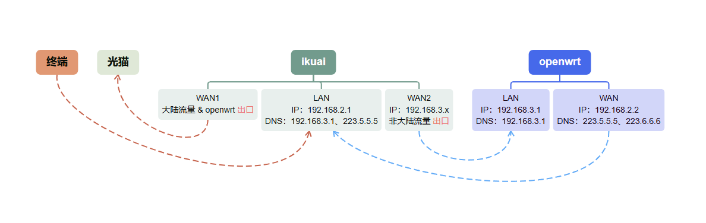

## 传统架构缺点

1.  **手动分流麻烦**
    
    -   每台设备需单独设置网关为旁路由IP，无法自动按规则分流（如仅代理国外流量）。
        
2.  **单点瓶颈**
    
    -   所有流量集中到旁路由，低性能设备（如树莓派）易成为带宽/CPU瓶颈。
        
3.  **故障难排查**
    
    -   旁路由宕机时，依赖它的设备直接断网，且无自动回退机制。
        
4.  **扩展性差**
    
    -   难以支持多旁路由负载均衡或高可用切换（需手动干预）。
        
5.  **IPv6兼容性问题**
    
    -   若主路由分配IPv6地址，流量可能绕过旁路由，导致代理/过滤失效。
        

## 传统架构跟互指架构优缺点对比

|     |     |     |
| --- | --- | --- |
| **对比项** | **传统旁路由架构** | **主旁互指架构** |
| **流量分流方式** | ❗ **手动**（设备单独设网关） | ✅ **自动**（按IP/MAC/端口智能分流） |
| **NAT问题** | ❗ **易嵌套**（需优化） | ✅ **可避免**（旁路由禁用NAT） |
| **性能瓶颈** | ❗ **单点压力大**（所有流量经旁路由） | ✅ **负载均衡**（可多旁路由分流） |
| **故障恢复** | ❗ **手动切换**（旁路由宕机需改网关） | ✅ **自动容灾**（支持VRRP/Keepalived） |
| **扩展性** | ❗ **差**（难支持多旁路由） | ✅ **强**（灵活添加策略路由） |
| **IPv6支持** | ❗ **兼容性差**（易绕过旁路由） | ✅ **完善**（可策略分流IPv6） |

## 互指架构流量路径

## 教程

> 想跟相关领域是小白说：你可以退出去了（或者看看下面的参考资料）
> 
> 因为互指架构我不太会描述出来☹大佬们一看就懂~

### 旁路由OpenWrt相关配置

启动DHCP

wan口获取主路由iKuai分配的IP，并设置为静态

### 主路由iKuai新增wan2

获取旁路由OpenWrt分配的IP，并设置为默认网关

### 主路由iKuai新增国内IP表

流控分流➡分流设置➡多线负载➡自定义运营商

国内IP表：[https://raw.githubusercontent.com/17mon/china\_ip\_list/master/china\_ip\_list.txt](https://raw.githubusercontent.com/17mon/china_ip_list/master/china_ip_list.txt)

### 主路由iKuai新增多线负载

### 主路由iKuai新增端口分流

源地址为旁路由OpenWrt的wan口IP

### 大功告成

你可以在旁路由上运行任何服务：如ADG、科学上网等

当旁路由失联时：会自动切换至wan1，避免全局断网

所以，尽情的造旁路由吧，无论如何都不会断网的（但是iKuai由wan2切换至wan1有1分钟的检测时间）

## 参考资料

- [https://www.bilibili.com/video/BV1NJ4m1H72V/?share\_source=copy\_web&vd\_source=bbce07b2cb20bee8889e8133f04baf49](https://www.bilibili.com/video/BV1NJ4m1H72V/?share_source=copy_web&vd_source=bbce07b2cb20bee8889e8133f04baf49)
- [https://www.right.com.cn/forum/thread-8252571-1-2.html](https://www.right.com.cn/forum/thread-8252571-1-2.html)