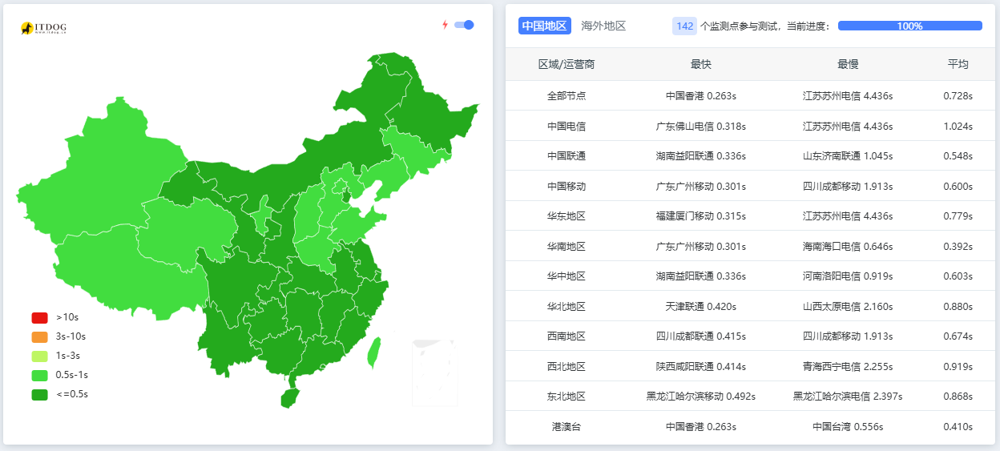

## **📌 什么是反向代理？为什么选择Netlify？**

反向代理就像是一个"中间人"👔，它站在你的网站和访问者之间，处理所有请求。而Netlify提供了超棒的免费反向代理功能！✨

**为什么选择Netlify？**

-   ✅ 完全免费计划可用
    
-   ⚡ 全球CDN加速
    
-   🔒 自动HTTPS加密
    
-   🛠️ 简单易用的配置
    

## **🧰 准备工作**

1.  **注册Netlify账号**：[https://app.netlify.com/signup](https://app.netlify.com/signup) 📝
    
2.  **准备你的网站域名** 🌍 (可以是现有网站或新项目)
    

## **🛠️ 配置Netlify反向代理**

1.  在项目根目录创建`netlify.toml`文件
    
2.  添加以下内容：
    
```toml
[[redirects]]
    from = "/*"
    to = "http(s)://{IP}:{PORT}/:splat"
    status = 200
    force = true
```

## **🚦 部署你的反向代理**

1.  将项目推送到GitHub/GitLab/Bitbucket
    
2.  在Netlify中导入仓库
    
3.  点击"Deploy site" 🚀
    

## **🔧 常见问题解决**

❓ **代理 HTTPS 站点时的证书要求**

-   **证书链必须完整**  
    Netlify 的反代服务会验证目标站点的证书链。如果证书缺失中间证书（如仅提供域名证书但未包含 CA 中间证书），会导致 TLS 握手失败。
    
-   **避免自签名证书**  
    自签名证书或过期证书可能被 Netlify 拒绝。建议使用受信任的 CA（如 Let's Encrypt、DigiCert）签发的证书。
    

❓ **代理后CSS/JS加载失败？**

-   检查相对路径，改为绝对路径
    
-   确保代理规则中的`:splat`参数正确
    

❓ **如何测试代理是否工作？**

```bash
curl -I https://你的netlify域名.com
```

查看返回头中的`x-nf-request-id`

❓ **性能优化建议**

-   启用Netlify的"Immutable assets"缓存
    
-   使用`Cache-Control`头优化静态资源
    

## 效果图



> 💡 小贴士：Netlify免费版每月有100GB带宽限制，对于大多数中小网站完全够用！
> 
> 优选IP：`apex-loadbalancer.netlify.com`