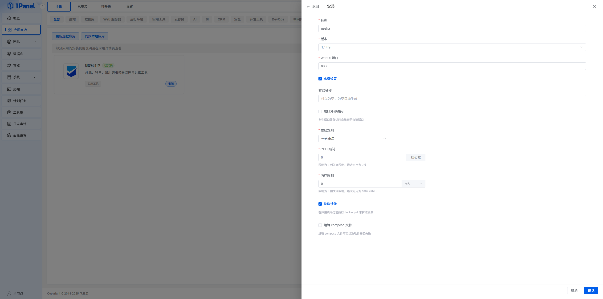

首先先把你的域名解析到Dashboard服务器上。

## 安装哪吒



搜索`哪吒`直接安装

## 配置反代


填好必要配置，启用`https`。


```yml
upstream dashboard {
    keepalive 512;
    server 127.0.0.1:8008;
}
```

在该处添加以上代码


```yml
location ^~ / {
    proxy_pass http://127.0.0.1:8008;
    proxy_set_header Host $host;
    proxy_set_header X-Real-IP $remote_addr;
    proxy_set_header X-Forwarded-For $proxy_add_x_forwarded_for;
    proxy_set_header REMOTE-HOST $remote_addr;
    proxy_set_header Upgrade $http_upgrade;
    proxy_set_header nz-realip $http_cf_connecting_ip;
    proxy_set_header Connection "upgrade";
    proxy_set_header X-Forwarded-Proto $scheme;
    proxy_http_version 1.1;
    proxy_read_timeout 3600s;
    proxy_send_timeout 3600s;
    proxy_buffer_size 128k;
    proxy_buffers 4 128k;
    proxy_busy_buffers_size 256k;
    proxy_max_temp_file_size 0;
    add_header X-Cache $upstream_cache_status;
    add_header Cache-Control no-cache;
    proxy_ssl_server_name off;
    proxy_ssl_name $proxy_host;
    add_header Strict-Transport-Security "max-age=31536000";
}

underscores_in_headers on;
set_real_ip_from 0.0.0.0/0; # CDN 回源 IP 地址段
real_ip_header CF-Connecting-IP; # CDN 私有 header，此处为 CloudFlare 默认

# gRPC 服务
location ^~ /proto.NezhaService/ {
    grpc_set_header Host $host;
    grpc_set_header nz-realip $http_CF_Connecting_IP;
    grpc_read_timeout 600s;
    grpc_send_timeout 600s;
    grpc_socket_keepalive on;
    client_max_body_size 10m;
    grpc_buffer_size 4m;
    grpc_pass grpc://dashboard;
}

# WebSocket 服务
location ~* ^/api/v1/ws/(server|terminal|file)(.*)$ {
    proxy_set_header Host $host;
    proxy_set_header nz-realip $http_cf_connecting_ip;
    proxy_set_header Origin https://$host;
    proxy_set_header Upgrade $http_upgrade;
    proxy_set_header Connection "upgrade";
    proxy_read_timeout 3600s;
    proxy_send_timeout 3600s;
    proxy_pass http://127.0.0.1:8008;
}
```

在该处添加以上代码

## 哪吒面板配置


Agent对接地址填写`刚刚创建的站点域名:443`

并启用`TLS连接`

## 结尾

好了，现在Dashboard已经全部配置完成，接下来只需傻瓜式添加你需要监控的服务器即可。

