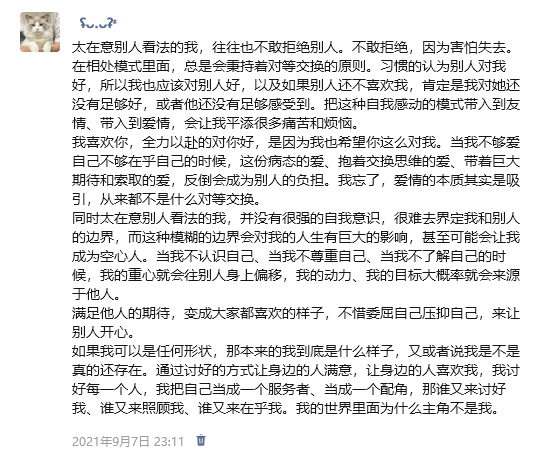

那夜，我将自己剖开，一字一句地写在朋友圈里。像迷路的人，在黑暗里点起一束微光，不为照亮前路，只为看看自己身在何处。那些关于"对等交换"的困惑，那些身为主角却活成配角的怅惘，在屏幕上凝成一声无声的叹息。

发出后，手机屏幕便亮起温柔的星霭。那些名字，像夜航途中远远望见的灯塔，一座接一座地亮起回应的光。"好起来啊哥"——话语简单，却像一只温热的手，沉沉地落在我的肩上。"不要在意别人说什么没必要"——这话像一阵清风，试图吹散我心头的雾霭。最触动我的，是那句朴素的真理："在生活中，每个人都是主角，你是为自己而活不是为别人而活。"

那时，我将这些话语一一拾起，如同落水者抓住伸来的竹篙。它们是我在情感泥沼中，四面八方抛来的绳索。

如今，时过境迁。有些重量确实从肩上卸下了。白昼来临，我能更从容地划下边界，更清晰地辨认自己的轮廓。那些温暖的安慰，像春风化雨，润泽了干涸的自我。

只是，有些战役转入了更深的腹地。

当暮色四合，世界安静下来，另一种清醒便悄然浮现。这时，我会取出那个小小的白色药盒，打开时发出细微的声响。那片小小的安眠药，是我与黑夜达成的契约，是让喧嚣的思绪暂时停驻的渡船。温水送服，像完成一个虔诚的仪式——我在学习与这份深夜独有的清醒和解，也在学习接受这些小小的、人为的宁静。

月光如水，照见的不再是纷乱的涟漪，而是一片渐渐平息的湖面。朋友们的箴言，被我悉心收藏，它们是我行囊里的珍宝，给予我前行的底气。但有些路，终究要自己一步一步去丈量。这条认识自己、接纳自己的路途，远比想象中蜿蜒与漫长。

迷路人的篝火早已熄灭，但我依然在这片原野上行走。带着那些温暖的火种，也带着这份需要借助小小药片才能获得的安眠。每一个平静入睡的夜晚，都是一个小小的胜利；每一次在晨曦中自然醒来，都是一份值得感激的馈赠。天光，总是在人最需要希望的时刻，悄然浸染窗棂。而我，还在学习与自己和睦相处，等待内心真正安宁的那一天。

