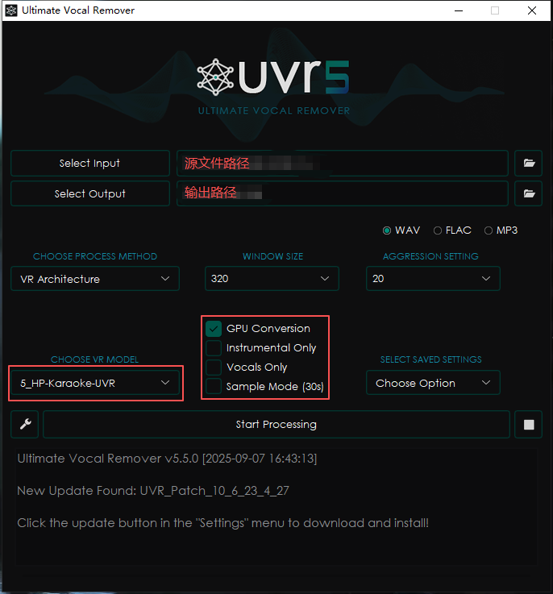

## 准备工作

1. **硬件要求**：
   - **GPU**：推荐使用N卡，显存推荐8G以上。使用GPU训练和推理速度极快。CPU虽然也能用，但速度会非常慢，不适合训练。
   - **内存**：至少16G。
   - **硬盘**：预留20-30GB可用空间，用于存放模型和音频数据。
2. **软件**：
   - **操作系统**：Windows。
   - [**RVC**](https://github.com/RVC-Project/Retrieval-based-Voice-Conversion-WebUI)：用于训练模型。
   - [**UVR**](https://github.com/Anjok07/ultimatevocalremovergui)：用于分离人声。

## 训练你自己的声音模型

1. **数据准备（数据集）**：
   - **音源要求**： 准备你想要克隆的声音的音频文件（如你自己的声音），要求：
     - **格式**：`.wav`（最佳）
     - **质量**： 高清、无损最好。人声清晰，没有背景噪音、没有混响、没有音乐。
     - **内容**： 如果是说话声音，需要包含多种音调；如果是唱歌，需要包含你的音域。时长10分钟到30分钟的纯净人声即可获得不错的效果。
     - **采样率**： 最好是44100Hz。
   - **如何获取干净人声？**
     - **自己录制**： 使用Audacity等录音软件，在安静的环境下录制。
     - **提取干声**： 如果是从已有歌曲中提取，需要使用**UVR**将人声和背景音乐分离开。
       > **UVR设置**：
       > 
       > **输出文件**：
       >   - **Instrumental**：背景音乐
       >   - **Vocals**：人声
   - **数据处理**：
     - 将所有准备好的`.wav`文件放在一个单独的文件夹里，例如`./dataset/your_name/`。
     - 文件名**不要有中文或特殊符号**。
2. **开始训练**：
    运行`go-web.bat`。设置好参数后点击`一键训练`即可。
    
    > **总训练轮数**：建议300-500 
    > *训练轮数越多，耗时越长，请自行规划好时间。*

## 使用模型进行声音转换

切换至`模型推理`，点击`刷新`就能看到训练好的模型。

`待处理音频文件路径`填写需要转换的音频文件路径，同样需要为**干净的人声**。

这一步很快，一首歌的时间大概仅需10秒左右。

---

希望这份教程能帮助你顺利进入RVC的世界！创作时请务必遵守法律法规，尊重他人的声音版权。