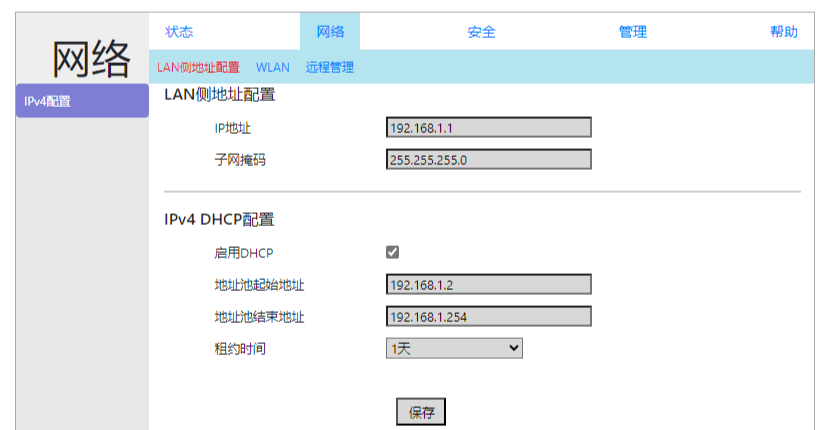
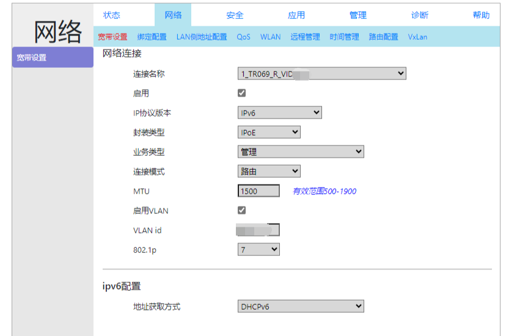
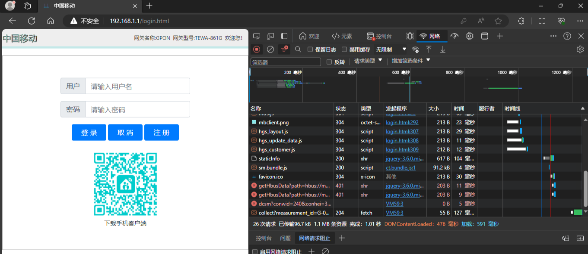
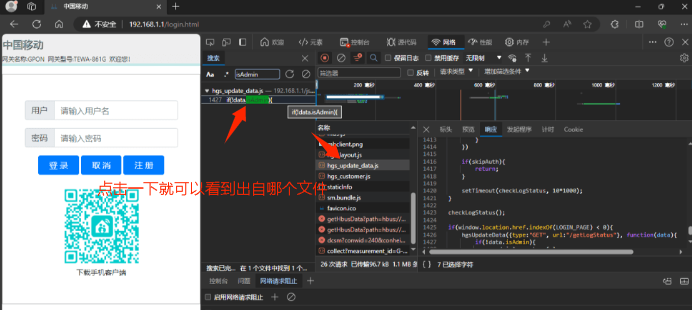
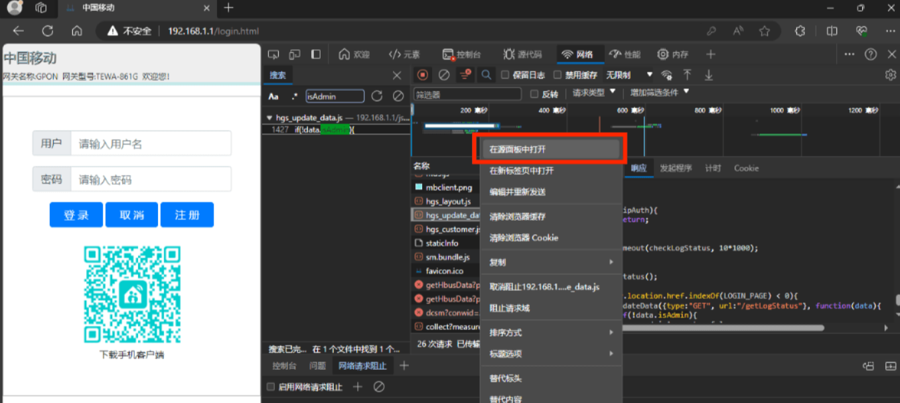
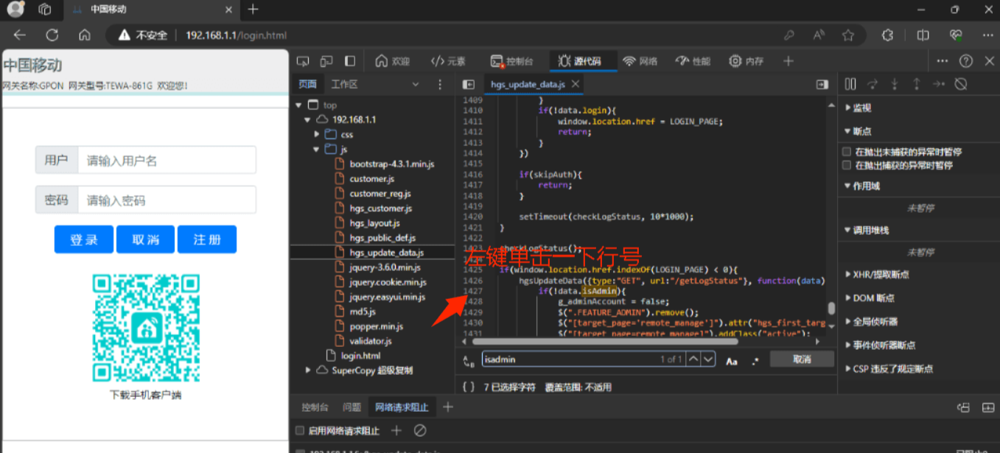
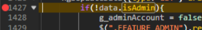
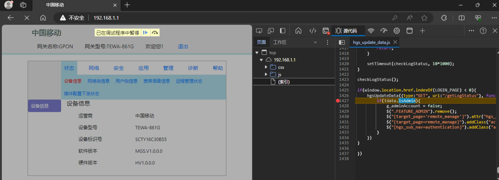
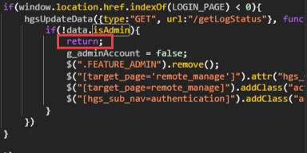
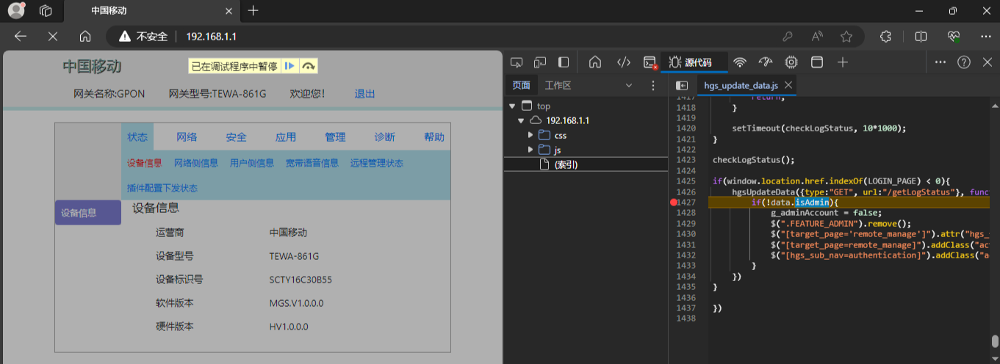

## 原理

光猫后端其实没有鉴定用户身份，只是在前端通过删除部分菜单来实现用户的区分

例如：


​​​
这是普通用户 user的网络菜单




这是超级管理员 superadmin的网络菜单

那么我们就可以hook该方法，通过普通用户user来进行superadmin的操作

## 方法（EDGE为例）

1. 打开调试台（F12），打开“网络”一栏，并刷新页面
    

2. Ctrl+F搜索"isAdmin"(无需带引号)，并定位到所在文件
     

3. 右键选择"在源面板中打开“ 
    

4. 再次Ctrl+F查找"isAdmin"，并在 isAdmin代码所属行行前行号打上断点（单击行号） 
    
    

5. 使用你的user账号登陆（账号密码位于你的光猫背面），此时跳转后会显示”已在调试程序中暂停“ 
    

6. 再次定位到"isAdmin"（找不到的Ctrl+F搜索）
    在这行下方加入
    ```js
    return;
    ```
    
    Ctrl+S保存，F8继续运行

BINGO！现在你就获得了SUPERADMIN的权限啦！

## 注意事项

因为网页会定时刷新来检测权限，刷新后会再次来到第5步（如下图），重做5-6步即可

